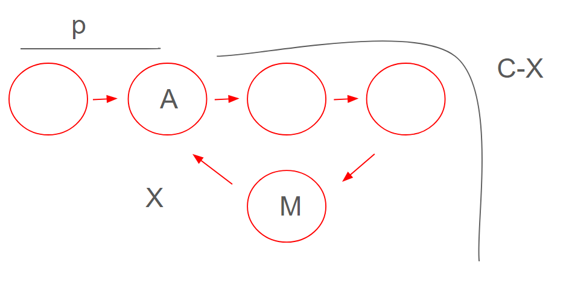

## 287. Find the Duplicate Number
- Q: Find the duplicate number which is in the range [1, n]
- Sol:
    - Use the `Floyd's algorithm`
    - Floyd's algorithm: Find the shortest path
        - In this case, we can use `slow` and `fast`
        - `slow` node move one node once and `fast` node move two node once.
        - proof:
            


            ```
                2 * slow = fast
                2 * (p + c - x) = p + n * c + c - x
                2p + 2c - 2x = p + (n + 1)*c -x
                p = (n - 1) * c + x 
            ``` 
            - it mean `fast` node will run the portion of cycle list (n - 1) * c time.
            - `slow` and `fast` meet in `M` node
            - `slow` move to head and `fast` move to next one node once. when they are meet, it is answer.
            
        - Implement: 
            - Use index to find the next node. For example, `[1,3,4,2,2]` the 
                - index 0 go to index 1
                - index 1 go to index 3
                - index 2 go to index 4
                - index 3 go to index 2
                - index 4 go to index 2
            - `slow = map[slow], fast = map[map[fast]]`
            - when slow == fast, slow move to head and `fast` move to next one node once.Finally, when they are meet, it is answer. 
